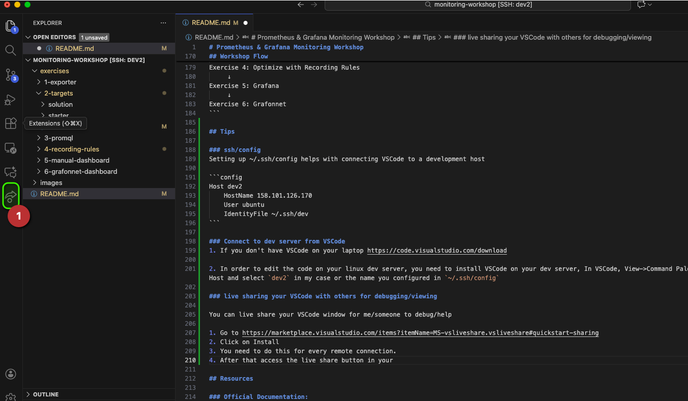

# Prometheus & Grafana Monitoring Workshop

A hands-on workshop for learning Prometheus and Grafana as it is deployed and used in our stack through practical exercises.

## Monitoring Architecture

This is our current monitoring architecture in our HPC stack. We are implementing a small but representative portion of it in a sandbox. After deploying your sandbox stack you should have 2 nodes. One node with grafana and prometheus and another to represent a single compute node.


## Workshop Overview

This workshop consists of 6 progressive exercises that teach you how to build a complete monitoring solution using Prometheus and Grafana.

## Infrastructure Setup

As a pre-requisite you should have created a 2 node cluster using HPC 3.0.0 stack with 1 controller node, enabled monitoring in the stack without an additional monitoring node and 1 CPU compute node.

### Nodes:
- **Controller Node**: Runs Prometheus and Grafana
- **Worker Node**: Runs exporters (node_exporter and custom app_exporter)

### Prerequisites:
- Python 3.x installed on worker node
- `prometheus_client` Python package installed
- Prometheus installed and configured on controller node
- Grafana installed on controller node
- node_exporter running on worker node

## Exercises

### [Exercise 1: Create a Basic Prometheus Exporter](exercises/1-exporter/README.md)
**Objective**: Learn to create a custom Prometheus exporter using Python's `prometheus_client` library.

**Topics Covered**:
- Prometheus client library basics. Docs https://prometheus.github.io/client_python/
- Gauge metric type
- HTTP metrics endpoint
- Metric naming conventions

**Deliverable**: A working Python exporter exposing `app_active_sessions` metric

---

### [Exercise 2: Configure Systemd Service and Prometheus Service Discovery](exercises/2-targets/README.md)
**Objective**: Deploy the exporter as a system service and configure Prometheus to scrape it.

**Topics Covered**:
- Systemd service unit files
- Service management with systemctl
- Prometheus file-based service discovery
- Configuration validation with promtool

**Deliverable**: Exporter running as a service, metrics visible in Prometheus

---

### [Exercise 3: Writing PromQL Queries](exercises/3-promql/README.md)
**Objective**: Learn Prometheus Query Language (PromQL) to query and analyze metrics.

**Topics Covered**:
- Instant and range vectors
- Query functions (rate, avg_over_time, etc.)
- Metric arithmetic and transformations
- Querying both custom and node_exporter metrics

**Deliverable**: 5 working PromQL queries analyzing system and application metrics

---

### [Exercise 4: Prometheus Recording Rules](exercises/4-recording-rules/README.md)
**Objective**: Create recording rules to pre-compute expensive queries for better performance.

**Topics Covered**:
- Recording rule syntax and structure
- Rule naming conventions
- Rule validation and deployment
- Performance optimization strategies

**Deliverable**: 2 recording rules (1 for app metrics, 1 for node metrics)

---

### [Exercise 5: Manual Grafana Dashboard Creation](exercises/5-manual-dashboard/README.md)
**Objective**: Build dashboard manually in Grafana.

**Topics Covered**:
- Dashboard and panel creation
- Visualization types (Time Series, Stat, Gauge)
- Panel configuration and styling
- Thresholds and units
- Dashboard variables and templating

**Deliverable**: A dashboard with 4+ panels built manually

---

### [Exercise 6: Grafonnet](exercises/6-grafonnet-dashboard/README.md)
**Objective**: Build the same dashboard as in previous exercise using Grafonnet a.k.a Dashboard-as-Code

**Topics Covered**:
- HPC Stack Dashboard components
- Visualization types (Time Series, Stat, Gauge)
- Panel configuration and styling
- Dashboard variables and templating

**Deliverable**: A dashboard with 4+ panels built using Grafonnet code 


---

## Exercise Structure

Each exercise contains:

```
<exercise-name>/
├── README.md           # Exercise instructions and learning objectives
├── starter/            # Incomplete files with TODOs for participants
│   └── ...
└── solution/           # Complete working solutions
    └── ...
```

## Getting Started

### 1. Fork repo (if you want to save your changes)

### 2. Clone (workshop or your forked repo) 

```bash
git clone <repository-url>
cd monitoring-workshop
```

### 2. Verify Prerequisites

**On Worker Node**:
```bash
# Check Python version
python3 --version

# Install prometheus_client
pip3 install prometheus_client

# Verify node_exporter is running
curl http://localhost:9100/metrics | head
```

**On Controller Node**:
```bash
# Check Prometheus
curl http://localhost:9090/-/healthy

# Check Grafana
curl http://localhost:3000/api/health

# Verify promtool
promtool --version
```

### 3. Start with Exercise 1

> Note: if you forked workshop repo the URL below would be different

https://github.com/sam-andaluri/monitoring-workshop/blob/main/README.md

> Follow each exercise in order, as they build upon each other.

## Workshop Flow

```
Exercise 1: Write Exporter
     ↓
Exercise 2: Deploy & Configure
     ↓
Exercise 3: Query Metrics (PromQL)
     ↓
Exercise 4: Optimize with Recording Rules
     ↓
Exercise 5: Grafana
     ↓
Exercise 6: Grafonnet
```

## Tips

### SSH config

Setting up ~/.ssh/config helps with connecting VSCode to a development host

```config
Host dev2
    HostName 1.2.3.4
    User ubuntu
    IdentityFile ~/.ssh/sam
```
### Connect to dev server from VSCode

1. If you don't have VSCode on your laptop https://code.visualstudio.com/download

2. In order to edit the code on your linux dev server, you need to install VSCode on your dev server, In VSCode, View->Command Palette->Remote SSH: Connect to Host and select `dev2` in my case or the name you configured in `~/.ssh/config`

### Terminal

VSCode includes a terminal in the same window View->Terminal where you can run commands.
This may be convenient than switching between VSCode and Windows Putty/Mac Terminal.

### Live sharing your VSCode with others for debugging/viewing

You can live share your VSCode window for me/someone to debug/help 

First follow instructions in **Connect to dev server from VSCode** first.

1. Go to https://marketplace.visualstudio.com/items?itemName=MS-vsliveshare.vsliveshare#quickstart-sharing
2. Click on Install
3. You need to do this for every remote connection.
4. After that access the live share button in your left handside menu bar in VSCode. See screenshot below:


## Resources

### Official Documentation:
- [Prometheus Documentation](https://prometheus.io/docs/)
- [Grafana Documentation](https://grafana.com/docs/)
- [Prometheus Python Client](https://github.com/prometheus/client_python)
- [PromQL Basics](https://prometheus.io/docs/prometheus/latest/querying/basics/)
- [Grafonnet](https://grafana.github.io/grafonnet/index.html)

### Community Resources:
- [Prometheus Best Practices](https://prometheus.io/docs/practices/)
- [Grafana Community Dashboards](https://grafana.com/grafana/dashboards/)
- [Node Exporter Full Dashboard](https://grafana.com/grafana/dashboards/1860)


## Contributing

If you find issues or have suggestions for improving this workshop, please open an issue or submit a pull request.

