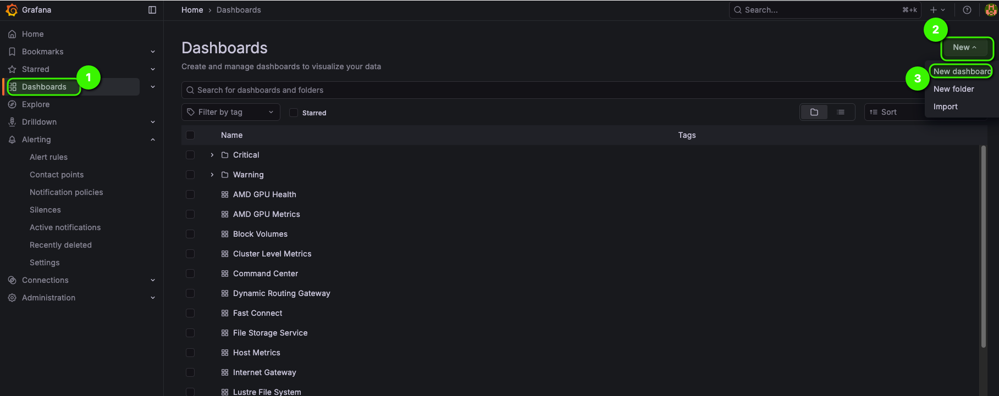
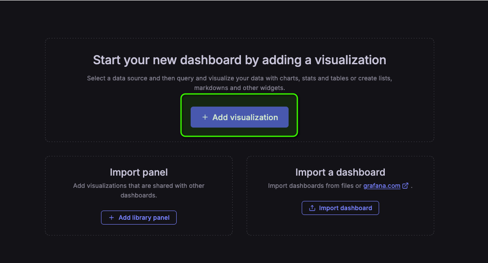
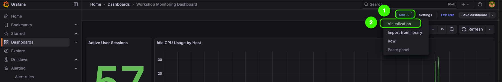
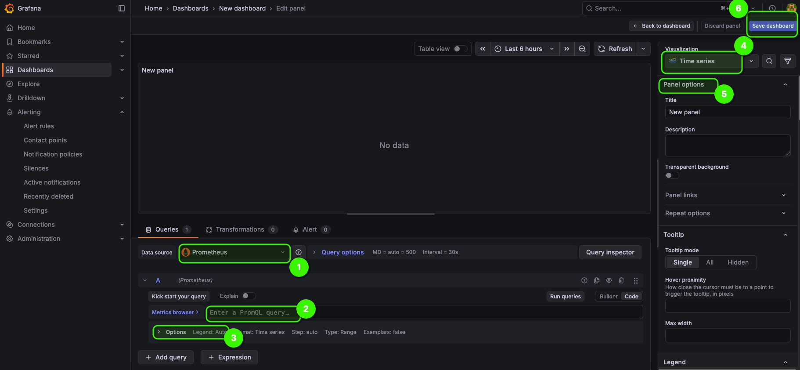
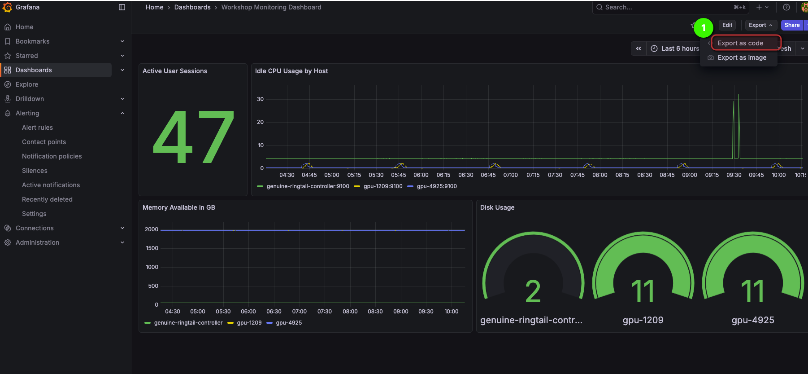
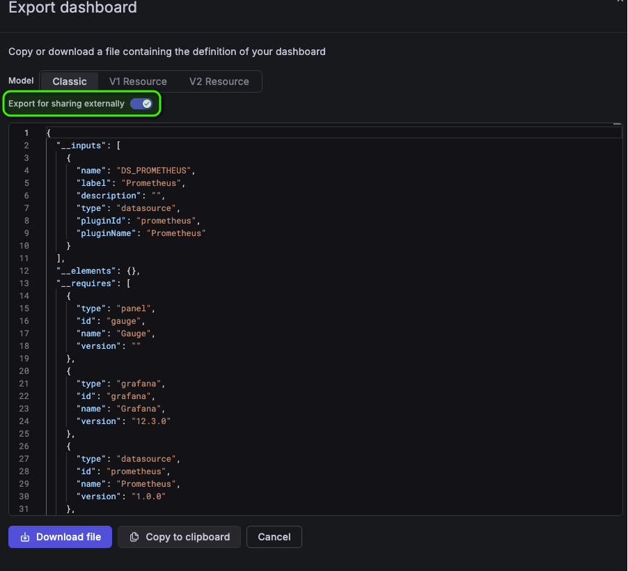

# Exercise 5: Creating a Manual Grafana Dashboard

Follow these steps to create a custom Grafana dashboard. Fill in the missing information marked with `???`.

## Step 1: Access Grafana

1. Access Grafana using URL and Admin password you obtained from Stack. 
2. Login

## Step 2: Create a New Dashboard

## Step 3: Add a visualization (repeat this step for all panels)

For the first panel

For subsequent panels

## Step 4: Design your panel for the metric

1. Select Prometheus (default) as the data source

2. 
   1. Make sure Prometheus is the datasource
   2. Write your PromQL query here
   3. Expand legend options, select Custom, add labels in here in this format `{{ hostname }}`
   4. Select your visualization type 
   5. Configure panel options e.g. units
   6. Save dashboard

## Step 5. Exporting dashboards
   

*IMPORTANT*

   
## Validation Checklist

Complete the following to verify your dashboard:

- [ ] Dashboard displays in Grafana UI
- [ ] Active Sessions panel shows real-time data
- [ ] CPU Usage panel shows time series graph
- [ ] Memory Usage panel displays correctly
- [ ] Disk Usage panel shows with color thresholds
- [ ] All queries return data without errors
- [ ] Panels are logically organized
- [ ] Dashboard has a meaningful name

